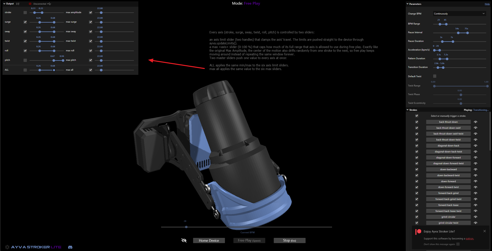

# ayva-stroker-lite

A small web based stroker app powered by [Ayva.js](https://github.com/ayvasoftware/ayvajs) and Vue 3.

This repository is a personal fork of
[Ayva Stroker Lite](https://github.com/ayvasoftware/ayva-stroker-lite). The original
step-by-step guide can be found
[here](https://ayvajs.github.io/ayvajs-docs/tutorial-ayva-stroker-lite.html).

## Features

### Output panel



Every axis (stroke, surge, sway, twist, roll, pitch) is controlled by two sliders:

- an **axis limit** slider (two handles) that clamps the axis' travel. The limits are
  pushed straight to the device through `ayva.updateLimits()`.
- a **max `<axis>`** slider (0-100 %) that caps how much of its full range that axis is
  allowed to use during free play. Exactly like the original Max Amplitude, the center of
  the motion also drifts randomly from one stroke to the next, so free play keeps moving
  around instead of repeating the same window forever.

Each axis also carries two checkboxes, one in front of each of its sliders:

- the left one decides whether the **ALL** slider drives that axis;
- the right one decides whether **max all** drives it.

An unchecked axis keeps its own values when a master slider moves. The two checkboxes on
the `ALL` row tick or untick their whole column at once. Everything starts ticked and is
remembered between sessions.

Two master sliders push one value to every axis at once:

- **ALL** applies the same min/max to the six axis limit sliders.
- **max all** applies the same value to the six max sliders.

The stroke axis keeps the historical `max-amplitude` name, so previously saved values and
scripts reading `parameters.maxAmplitude` keep working.

### Free play

- Random BPM range, switching either instantly or with continuous acceleration.
- Random pause intervals and durations, with a smooth deceleration/acceleration ramp on
  each side of every pause.
- Random pattern and transition durations.
- Optional default twist with its own range, phase and eccentricity.
- The built-in TempestStroke library, plus custom strokes and AyvaScript behaviors.
- Manual mode: trigger any stroke directly from the Strokes panel.

### Browser support

Tested and working well with **Microsoft Edge**.

## Project Setup

```sh
npm install
```

### Compile and Hot-Reload for Development

```sh
npm run dev
```

### Compile and Minify for Production

```sh
npm run build
```

### Lint with [ESLint](https://eslint.org/)

```sh
npm run lint
```

## Credits

Ayva Stroker Lite is created and maintained by
[ayvasoftware](https://github.com/ayvasoftware). All credit for the original app, the
Ayva.js library and the TempestStroke patterns goes to its authors.
